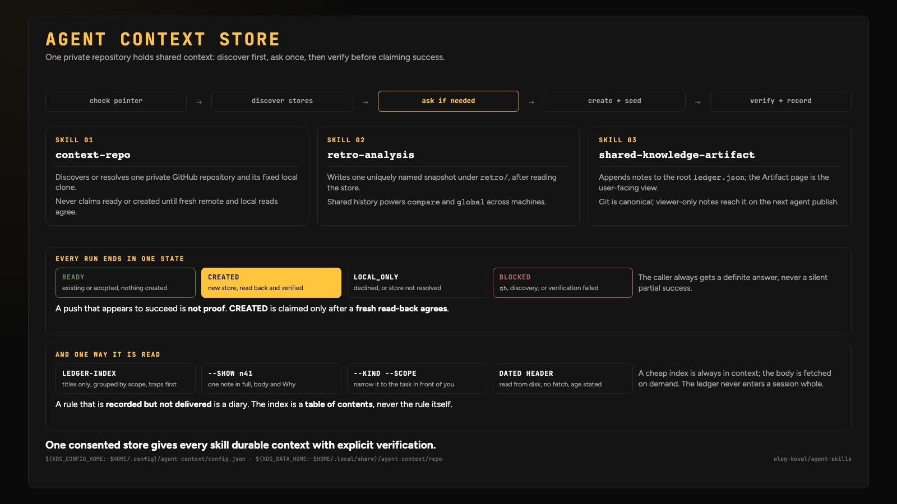

<div align="center">
  <h1>agent skills</h1>
  <p><strong>Agent-agnostic skill catalog for Codex, Claude, Cursor, Grok, Copilot, Windsurf, Kiro, and other skill-aware tools.</strong></p>
  <p>
    
    
    
    
  </p>
</div>

Agent-agnostic skill collection for Codex, Claude, Cursor, Grok, and other skill-aware tools.

**Browse the catalog: [skills.olegkoval.com](https://skills.olegkoval.com)**

These skills are opinionated by design. They encode working defaults, preferred tools, and repeatable workflows instead of trying to be neutral snippets. Treat them as starting points with taste: useful out of the box, easy to inspect, and specific enough for an agent to execute consistently.

```
  PR & GIT        BUILD         OPERATE        IMPROVE        PERSONAL
 ┌────────────┐ ┌────────────┐ ┌────────────┐ ┌────────────┐ ┌────────────┐
 │ github-pr  │ │  product   │ │  web-ops   │ │ skill-meta │ │  creative  │
 │ git-tools  │ │ apple-kit  │ │  obsidian  │ │ reflection │ │            │
 │  release   │ │ garmin-kit │ │            │ │            │ │            │
 └────────────┘ └────────────┘ └────────────┘ └────────────┘ └────────────┘
```

---

## Start here

Ten skills across different plugins that cover the most common jobs. Full catalog is below.

| What you're doing | Skill | Key principle |
|--------------------|-------|----------------|
| Reviewing a PR beyond a single pass or a bot | [lekker-review](plugins/olko-github-pr/skills/lekker-review/SKILL.md) (`olko:lekker-review`) | Findings need proof, not a confident tone |
| Driving a PR to merge-ready in one pass | [pr-to-green](plugins/olko-github-pr/skills/pr-to-green/SKILL.md) (`olko:pr-to-green`) | Chain the fix loops instead of running them by hand |
| Getting CI back to green after a push | [ci-fix-loop](plugins/olko-github-pr/skills/ci-fix-loop/SKILL.md) (`olko:ci-fix-loop`) | Diagnose from the real failing log, not a guess |
| Committing with a real conventional message | [git-commit](plugins/olko-git-tools/skills/git-commit/SKILL.md) (`olko:git-commit`) | The message describes the diff, not the intent |
| Closing out a finished piece of work | [wrap-up](plugins/olko-reflection/skills/wrap-up/SKILL.md) (`olko:wrap-up`) | Verify against the original objective before cleaning up |
| Running a recurring engineering retrospective | [retro-analysis](plugins/olko-reflection/skills/retro-analysis/SKILL.md) (`olko:retro-analysis`) | Evidence from delivery and code, not vibes |
| Going from idea to a shippable MVP | [mvp-oneshot](plugins/olko-product/skills/mvp-oneshot/SKILL.md) (`olko:mvp-oneshot`) | Scope for one week, not the whole roadmap |
| Ramping up on an unfamiliar codebase fast | [crash-course](plugins/olko-reflection/skills/crash-course/SKILL.md) (`olko:crash-course`) | Source-grounded, timed, and testable |
| Cutting a release from ready-code to submitted-build | [release-day](plugins/olko-release/skills/release-day/SKILL.md) (`olko:release-day`) | One orchestrated pass, not five manual steps |
| Starting the workday with the queue synced | [morning-routine](plugins/olko-obsidian/skills/morning-routine/SKILL.md) (`olko:morning-routine`) | Chain the routines instead of running them separately |

---

## Quick Start

<details>
<summary><b>Claude Code</b></summary>

The repository includes a generated Claude marketplace manifest at `.claude-plugin/marketplace.json`.

**For marketplace installs:**

```text
/plugin marketplace add oleg-koval/agent-skills
```

Then install any of the eleven plugins by name:

```text
/plugin install olko-github-pr@olko-agent-skills
/plugin install olko-git-tools@olko-agent-skills
/plugin install olko-release@olko-agent-skills
/plugin install olko-product@olko-agent-skills
/plugin install olko-skill-meta@olko-agent-skills
/plugin install olko-reflection@olko-agent-skills
/plugin install olko-obsidian@olko-agent-skills
/plugin install olko-apple-kit@olko-agent-skills
/plugin install olko-garmin-kit@olko-agent-skills
/plugin install olko-creative@olko-agent-skills
/plugin install olko-web-ops@olko-agent-skills
```

Install only the plugins you need; each is independent.

**Upgrading from the single `olko-agent-skills` plugin:**

Releases up to `v1.34.0` shipped one plugin also named `olko-agent-skills`.
`v1.35.0` split it into the eleven above and dropped that name from
`marketplace.json`, so an install of it can no longer be resolved: `/plugin
update` reports `Plugin "olko-agent-skills" not found` and the install stays
pinned at `1.34.0` forever. Remove the stale entry once, then install the
plugins you want from the list above.

```text
/plugin uninstall olko-agent-skills@olko-agent-skills
```

**For local development:**

Clone the repo and point Claude Code at the plugin directory:

```bash
git clone https://github.com/oleg-koval/agent-skills.git
claude --plugin-dir /path/to/agent-skills
```

</details>

<details>
<summary><b>Codex</b></summary>

Install all package symlinks into your local Codex skills directory:

```bash
git clone https://github.com/oleg-koval/agent-skills.git
cd agent-skills
./scripts/install-codex-symlinks.sh
```

Then mention a lookup name in a new Codex session:

```text
Use the olko:semantic-release-beta skill to add prereleases on a beta branch.
```

</details>

<details>
<summary><b>Grok</b></summary>

Grok (xAI) supports plugins via marketplace or direct path. Add this catalog as a marketplace source:

```bash
grok plugin marketplace add oleg-koval/agent-skills
```

Or for local development / direct use:

```bash
grok agent --plugin-dir /path/to/agent-skills
```

Skills are available via their `olko:*` names or through the installed plugin. Grok discovers `plugin.json` + `skills/` (and falls back to `.claude-plugin/` manifests for compatibility).

The repo generates `.grok-plugin/index.json` for structured plugin discovery.

</details>

<details>
<summary><b>Cursor</b></summary>

Copy the relevant `SKILL.md` or adapter content into `.cursor/rules/`, or reference the full package directory from your Cursor rules.

</details>

<details>
<summary><b>GitHub Copilot</b></summary>

Copy `.github/copilot-instructions.md` to your repository and enable Copilot. It will automatically apply skill guidance.

</details>

<details>
<summary><b>Windsurf</b></summary>

Copy the relevant `.windsurf/rules/{skill-name}.md` into your project's `.windsurf/rules/` directory. Windsurf picks them up automatically as Cascade Rules.

</details>

<details>
<summary><b>Kiro</b></summary>

Copy the relevant `.kiro/steering/{skill-name}.md` into your project's `.kiro/steering/` directory.

</details>

<details>
<summary><b>Other agents</b></summary>

Skills are plain Markdown. Use the canonical package file directly:

```text
plugins/{plugin}/skills/{skill}/SKILL.md
```

</details>

---

## All 52 Skills

Each entry links to its `SKILL.md`. Reference any skill by its `olko:*` lookup name in a new agent session. Skills are grouped by the plugin that owns them.

### olko-github-pr (11)

Drive GitHub pull requests to merge-ready: review-bot loops, CI fixes, descriptions, dependency triage.

| Skill | What it does | Use when |
|-------|-------------|----------|
| [pr-finalize](plugins/olko-github-pr/skills/pr-finalize/SKILL.md) | Drives one GitHub PR to genuinely merge-ready: rebases and resolves conflicts, sweeps every review bot and human comment, verifies unit and E2E coverage really exists, and runs the repo's own lint/format/test gates before pushing | Finalizing a PR, clearing all outstanding review comments, or getting a branch merge-ready in one pass |
| [pr-finalize-complete](plugins/olko-github-pr/skills/pr-finalize-complete/SKILL.md) | Confirms a PR is genuinely merge-ready when the work is believed done: re-checks each finding against current code, separates stale comments from fixed ones, and runs the real lint/test gates before reporting | A branch owner says it's already fixed and you need that verified rather than assumed |
| [pr-to-green](plugins/olko-github-pr/skills/pr-to-green/SKILL.md) | Orchestrates a GitHub PR from first push to merge-ready: runs ci-fix-loop until checks are green, detects active AI review bots, runs qodoloop and coderabbitloop in sequence, and confirms zero unresolved threads | Driving a PR to merge-ready in one pass without manually chaining the fix loops |
| [pr-description-writer](plugins/olko-github-pr/skills/pr-description-writer/SKILL.md) | Drafts and posts a GitHub PR title and body from git diff and commit history, respecting existing PR templates | Opening a PR after pushing a branch or wanting a structured PR description written automatically |
| [qodoloop](plugins/olko-github-pr/skills/qodoloop/SKILL.md) | Iteratively drives a GitHub PR to zero unresolved Qodo findings, reading each finding's own Agent Prompt, replying to the thread, and resolving it | Fully addressing a PR against Qodo's code review before merging |
| [coderabbitloop](plugins/olko-github-pr/skills/coderabbitloop/SKILL.md) | Iteratively drives a GitHub PR to zero unresolved CodeRabbit findings, reading each inline comment's own Prompt for AI Agents block, replying to the thread, and resolving it | Fully addressing a PR against CodeRabbit's review before merging |
| [codexloop](plugins/olko-github-pr/skills/codexloop/SKILL.md) | Iteratively drives a GitHub PR to zero unresolved OpenAI Codex comments, but verifies each finding against the real code first and rebuts false positives instead of editing correct code | Clearing a Codex review without cargo-culting its suggestions |
| [geminiloop](plugins/olko-github-pr/skills/geminiloop/SKILL.md) | Iteratively drives a GitHub PR to zero unresolved Gemini Code Assist comments, treating each as a claim to verify, fixing the correct ones and rebutting the rest with evidence | Clearing a Gemini Code Assist review whose findings need checking first |
| [ci-fix-loop](plugins/olko-github-pr/skills/ci-fix-loop/SKILL.md) | Diagnoses GitHub Actions CI failures in a loop: fetches failing check logs, applies a targeted fix, pushes, and waits for the next run, repeating until green or a blocker needs a human | CI is red after a push and you want it driven to green automatically |
| [dependabot-triage](plugins/olko-github-pr/skills/dependabot-triage/SKILL.md) | Triages open Dependabot and Renovate PRs in bulk: classifies by risk tier, auto-approves safe patch bumps, flags breaking major upgrades for human review, and posts a digest | Clearing a backlog of dependency update PRs during a maintenance window |
| [lekker-review](plugins/olko-github-pr/skills/lekker-review/SKILL.md) | Runs a FAANG-quality PR review in an isolated worktree: 5 parallel specialist agents, adversarial finding verification, proof-of-bug tests for Criticals, and an optional --fix mode that applies and commits its own findings (Claude Code only, needs the Workflow tool) | Reviewing a GitHub PR beyond what a single-pass review or a bot reviewer catches |

#### lekker-review at a glance

Full write-up in the [skill README](plugins/olko-github-pr/skills/lekker-review/README.md).


### olko-git-tools (3)

Everyday git and GitHub CLI operations: conventional commits, branch hygiene.

| Skill | What it does | Use when |
|-------|-------------|----------|
| [git-commit](plugins/olko-git-tools/skills/git-commit/SKILL.md) | Creates conventional commits with diff-aware staging and message generation | Asking to commit changes or wanting a conventional commit message from the current diff |
| [gh-cli](plugins/olko-git-tools/skills/gh-cli/SKILL.md) | Guides GitHub CLI usage for repos, PRs, Actions, releases, issues, and all related GitHub operations | A task needs a `gh` command and the exact syntax isn't obvious, or the user says "use gh" or "what is the gh command for"; for driving a PR through review bots and CI use the olko-github-pr skills instead |
| [branch-cleanup](plugins/olko-git-tools/skills/branch-cleanup/SKILL.md) | Prunes stale git branches after a merge wave: deletes closed/merged remote branches, removes local tracking refs that no longer exist on the remote, and optionally cleans up merged local branches | Tidying up after a Dependabot triage batch merge or a sprint wind-down |

### olko-release (5)

Ship a release: semantic-release setup, changelogs, store listing copy, release-day routine.

| Skill | What it does | Use when |
|-------|-------------|----------|
| [semantic-release-beta](plugins/olko-release/skills/semantic-release-beta/SKILL.md) | Sets up `semantic-release` with stable `main` releases and beta prereleases on a `beta` branch | A Node package needs stable npm publishing plus beta prereleases, or its releases are still manual and should become commit-driven; for writing the notes of one release use changelog-generator |
| [open-source-publisher](plugins/olko-release/skills/open-source-publisher/SKILL.md) | Prepares an open-source repository for public publishing with branding, CI/CD, and release hygiene | Releasing a private project publicly with proper GitHub Pages, README, and social preview |
| [release-day](plugins/olko-release/skills/release-day/SKILL.md) | Orchestrates a full release-day workflow for iOS, Android, or Garmin apps: verifies CI is green, generates a changelog, drafts store listing copy, triggers semantic-release or tags manually, waits for the build, and queues the App Store submission | Cutting a release from "code is ready" to "build submitted" in one orchestrated pass |
| [changelog-generator](plugins/olko-release/skills/changelog-generator/SKILL.md) | Transforms git commits into polished user-facing changelogs by categorising changes and rewriting technical commit messages | Preparing release notes, a CHANGELOG entry, or "what changed since the last release"; for setting up the release pipeline itself use semantic-release-beta |
| [store-listing-copy](plugins/olko-release/skills/store-listing-copy/SKILL.md) | Generates platform-validated App Store, Google Play, and Connect IQ store listing copy (title, subtitle, description, what's new, keywords) from a git changelog | Writing store copy before submitting to apple-store-submit or the garmin-watchface store workflow |

### olko-product (4)

Take a product idea to a shippable build: MVP passes, full-stack scaffolds, launch plans.

| Skill | What it does | Use when |
|-------|-------------|----------|
| [product-builder](plugins/olko-product/skills/product-builder/SKILL.md) | Builds a full-stack web app or SaaS product from a user description using production-oriented defaults | Building a complete app, SaaS, dashboard, or product rather than a prototype |
| [mvp-oneshot](plugins/olko-product/skills/mvp-oneshot/SKILL.md) | Takes a rough product idea and produces a scoped, testable MVP plan and initial implementation in a single pass | Going from idea to a shippable one-week MVP without losing scope |
| [starter-rules](plugins/olko-product/skills/starter-rules/SKILL.md) | Loads and enforces hard rules for every oleg-koval/* starter | Ensuring 300-line files, E2E tests, pre-commit hooks, Vertical Slice architecture, and KISS/DRY/SOLID |
| [viral-launch](plugins/olko-product/skills/viral-launch/SKILL.md) | Sets up a project repository and launch plan for shareable marketing, public launch readiness, and growth loops | Preparing a repo, product, or package for public launch ("prep for Product Hunt", "write the launch post", "make this shareable"); for building the thing itself use mvp-oneshot or product-builder |

### olko-skill-meta (8)

Author and maintain agent skills and the AI toolchain itself.

| Skill | What it does | Use when |
|-------|-------------|----------|
| [context-repo](plugins/olko-skill-meta/skills/context-repo/SKILL.md) | Resolves a single durable, private GitHub repository other skills use to persist context they produce, retro snapshots and shared-knowledge notes among them, searching the account for a store that already exists before ever asking to create one | A skill needs a durable, cross-machine store for content it generates, rather than a local scratch directory that does not survive across machines or repos |
| [add-to-my-skills](plugins/olko-skill-meta/skills/add-to-my-skills/SKILL.md) | Copies a newly created skill from another repo into this catalog, refreshes the README and generated manifests, then commits and pushes | Adding a skill you wrote elsewhere into this catalog |
| [skill-budget-audit](plugins/olko-skill-meta/skills/skill-budget-audit/SKILL.md) | Diagnoses and fixes Claude Code's skill context budget overflow, identifies heavy plugin bundles that exceed the 2% budget | Skills failing to load or Claude hitting context limits from plugin bundles |
| [promptctl](plugins/olko-skill-meta/skills/promptctl/SKILL.md) | Uses `promptctl` for reusable prompt templates, scoring, and workflow automation | A project needs prompt conventions, scoring, or reusable prompt templates, or the user names promptctl directly; for bringing a skill into this catalog use add-to-my-skills |
| [veto-routing](plugins/olko-skill-meta/skills/veto-routing/SKILL.md) | Routes or executes AI tasks through Veto across configured providers while preserving privacy, cost, transport, and output boundaries | A task needs cost-aware multi-provider model selection, execution, fallback, or a machine-readable routing decision |
| [ai-tools-setup](plugins/olko-skill-meta/skills/ai-tools-setup/SKILL.md) | Sets up, repairs, and reports on the RTK + ICM + Vox AI development toolkit, installs missing tools, fixes broken hooks and MCP config | Bootstrapping AI dev tools on a new machine, or the user says "my hooks are broken", "MCP is not loading", "check my toolkit", "is ICM working"; also runs as the scheduled weekly toolkit report |
| [relay](plugins/olko-skill-meta/skills/relay/SKILL.md) | Uses `claude-relay` to run long or rate-limit-prone tasks autonomously across subscription accounts | A task will outlive one session or hit rate limits partway through |
| [shared-knowledge-artifact](plugins/olko-skill-meta/skills/shared-knowledge-artifact/SKILL.md) | Builds a shared, self-persisting knowledge ledger as a Claude Artifact, a private page that stores its own data, renders itself from it, and publishes new versions of itself so several agents read the same lessons and append to them | Giving multiple agents one place to learn from each other instead of repeating the same mistakes |

### olko-reflection (6)

Look back and improve: self-critique, retrospectives, performance review, rapid learning.

| Skill | What it does | Use when |
|-------|-------------|----------|
| [self-critique](plugins/olko-reflection/skills/self-critique/SKILL.md) | Adversarially critiques your own last answer: spawns a critic agent that verifies claims against live sources, then loops until satisfied and reports where you were wrong | Checking a substantial answer before the user has to |
| [review-past-performance](plugins/olko-reflection/skills/review-past-performance/SKILL.md) | Pulls 24h of ICM memories, git history, and skill analytics; detects repeated mistakes and slow workflows; proposes 1-3 concrete fixes | Daily self-improvement loop or codifying a repeated workflow |
| [retro-analysis](plugins/olko-reflection/skills/retro-analysis/SKILL.md) | Produces repository, comparison, and cross-project retrospectives from delivery, code-quality, work-pattern, and trend evidence | The user asks for a retro over shipped work ("run a retrospective", "how did this quarter go", "what did we ship") or a scheduled retro job fires; for agent-operations retros use agent-ops-retro, for a single finished change use wrap-up |
| [agent-ops-retro](plugins/olko-reflection/skills/agent-ops-retro/SKILL.md) | Retrospective on how the agents themselves are being operated: mines local transcripts and reads the reports other jobs already produce to surface what the human keeps repeating, what the guardrails caught, and where delivery leaked, carrying unactioned findings forward | Checking agent usage, delegation cost, or repeating corrections across sessions rather than shipped code |
| [crash-course](plugins/olko-reflection/skills/crash-course/SKILL.md) | Expert tutor for rapid, source-grounded learning of any topic: a timed 4-hour sprint plus cheat-sheet, learning-ladder, quiz-me, Feynman, and resource-curation modes | Ramping up on an unfamiliar codebase, project, or concept under time pressure |
| [wrap-up](plugins/olko-reflection/skills/wrap-up/SKILL.md) | Verifies a completed task against its original objective, confirms applicable checks, and safely tidies task-owned artifacts, worktrees, and local branches | A change is believed done and the user says "wrap up", "we are done here", or "clean up after this", or before handing work off; for a retro over repository history use retro-analysis |

### olko-obsidian (3)

Keep an Obsidian vault in sync with work: PR sync, task rollover, morning routine.

| Skill | What it does | Use when |
|-------|-------------|----------|
| [obsidian-pr-sync](plugins/olko-obsidian/skills/obsidian-pr-sync/SKILL.md) | Fetches open GitHub PRs assigned to you or requesting review and writes a grouped age-sorted section into today's Obsidian daily note | Syncing GitHub review queue to Obsidian at the start of the day or on demand |
| [obsidian-task-rollover](plugins/olko-obsidian/skills/obsidian-task-rollover/SKILL.md) | Migrates unchecked tasks from today's Obsidian daily note to the next workday under `## Carried over` | End-of-day bullet-journal task migration |
| [morning-routine](plugins/olko-obsidian/skills/morning-routine/SKILL.md) | Runs the complete start-of-day setup in one pass: rolls over unfinished Obsidian tasks, syncs open GitHub PRs into today's daily note, and sweeps safe Dependabot patch bumps | Starting the workday by chaining obsidian-task-rollover, obsidian-pr-sync, and dependabot-triage in sequence |

### olko-apple-kit (2)

Build and ship Apple platform apps: macOS menubar apps, App Store submissions.

| Skill | What it does | Use when |
|-------|-------------|----------|
| [apple-store-submit](plugins/olko-apple-kit/skills/apple-store-submit/SKILL.md) | Handles App Store rejection emails end-to-end, parses rejection reasons, creates a fix plan, implements code changes, and prepares resubmission | Responding to App Store rejections for privacy strings, entitlements, or guideline violations |
| [macos-menubar-app](plugins/olko-apple-kit/skills/macos-menubar-app/SKILL.md) | Builds a production-quality macOS menubar or notch app in SwiftUI, MenuBarExtra setup, sandbox entitlements, keyboard shortcuts, sound effects | Building a native macOS utility that lives in the menu bar or Dynamic Island notch |

### olko-garmin-kit (1)

Build, test and publish Garmin Connect IQ watch faces.

| Skill | What it does | Use when |
|-------|-------------|----------|
| [garmin-watchface](plugins/olko-garmin-kit/skills/garmin-watchface/SKILL.md) | Designs, builds, tests, screenshots, and publishes Garmin Connect IQ watch faces in Monkey C | Working on a Connect IQ watch face, SVG design proposals, inspiration gathering, layout that clips or overlaps, simulator screenshots, app settings, device support, or store submission |

### olko-creative (5)

Creative and personal projects: photo galleries, music players, Plex ingest, listings, wiki editing.

| Skill | What it does | Use when |
|-------|-------------|----------|
| [gallery](plugins/olko-creative/skills/gallery/SKILL.md) | Creates photo galleries with AI-assisted layout curation and sequencing | Building a gallery from photos or planning photo layout, sequencing, and curation |
| [fill-music-player](plugins/olko-creative/skills/fill-music-player/SKILL.md) | Fills a portable music player with a curated random selection while balancing formats, artists, albums, and capacity | Copying music from a NAS or local library to a Walkman, iPod, USB drive, or similar device |
| [music-to-plex](plugins/olko-creative/skills/music-to-plex/SKILL.md) | Acquires albums, DJ crates, and YouTube playlists for Plex/Plexamp with verified NAS delivery, Plex visibility, and source-backed Obsidian radio notes | Adding or downloading music to Plex/Plexamp, including an album request, DJ crate, or YouTube playlist |
| [vinted-listing](plugins/olko-creative/skills/vinted-listing/SKILL.md) | Creates and safely publishes Vinted listings from verified item details and the seller's original photos, with automatic suggestions, duplicate checks, draft verification, and publish confirmation | Listing, selling, relisting, or pricing an item on Vinted, or editing and publishing an existing draft |
| [wikipedia-uk-editor](plugins/olko-creative/skills/wikipedia-uk-editor/SKILL.md) | Drafts policy-compliant Ukrainian Wikipedia edits, en→uk translation, stub expansion, sourcing, backlog cleanup, returning ready-to-paste wikitext, an edit summary, and a verified source list | Editing, translating, or sourcing a uk.wikipedia.org article, or planning what to contribute next |

### olko-web-ops (4)

Operate a website: WAF rules, search console audits, analytics bootstrap, docs indexes.

| Skill | What it does | Use when |
|-------|-------------|----------|
| [cloudflare-block-countries](plugins/olko-web-ops/skills/cloudflare-block-countries/SKILL.md) | Blocks specific countries via Cloudflare WAF Custom Rules using the API | Geo-blocking traffic or setting up WAF country rules across single or multiple zones |
| [search-console-indexing-audit](plugins/olko-web-ops/skills/search-console-indexing-audit/SKILL.md) | Audits Google Search Console Coverage exports against sitemap, robots, canonical, redirect, and noindex signals | Diagnosing GSC indexing issues such as redirects, canonical alternates, and discovered-but-not-indexed pages |
| [docs-index-keeper](plugins/olko-web-ops/skills/docs-index-keeper/SKILL.md) | Keeps a Markdown docs index in sync through pre-commit, CI, or one-off maintenance flows | A repo's docs index is stale, needs a CI check added, or new docs were added without being linked anywhere |
| [website-analytics-bootstrap](plugins/olko-web-ops/skills/website-analytics-bootstrap/SKILL.md) | Sets up persistent SerpBear rank tracking, Google Search Console, seeded keywords, read-only SEO audits, and Telegram alerts on a local host or NAS | Bootstrapping SEO analytics and monitoring for a site with no tracking yet; for diagnosing an existing indexing problem use search-console-indexing-audit |

---

## How Skills Work

Every skill package follows a consistent anatomy:

```text
┌─────────────────────────────────────────────────────┐
│  SKILL.md                                            │
│                                                       │
│  ┌─ Frontmatter ─────────────────────────────────┐   │
│  │ name: lowercase-hyphen-name                    │   │
│  │ description: What this skill does. Use when…   │   │
│  │ license / allowed-tools / compatibility        │   │
│  └─────────────────────────────────────────────────┘  │
│  Body            → numbered steps or phases,          │
│                     specific to the task               │
│  Report          → what to hand back and how           │
└─────────────────────────────────────────────────────┘
```

**Key design choices:**

- **Progressive disclosure.** Only `name` and `description` load into an agent's context up front. The body loads on invocation, which is why every description also carries its own "Use when" clause: it is the only routing signal an agent sees before deciding whether to open the file.
- **One canonical package per workflow.** `plugins/olko-{plugin}/skills/{skill}/SKILL.md` is the single source; agent-specific wrappers wrap it, they never fork it.
- **Description is the router.** A skill's `description` must say what it does and name the phrases a user would actually type, because that sentence is what an agent matches against, not the body.
- **Process over prose.** Skills read as workflows to follow (numbered steps, phases, gates), not as reference essays.
- **Adapters stay generated.** Per-tool wrappers under `adapters/`, `.windsurf/rules/`, `.kiro/steering/`, `.github/prompts/` and similar are built from `catalog/skills.json`; nothing there is hand-written.

Install the Codex symlinks, then mention a skill by its lookup name in a new agent session:

```bash
./scripts/install-codex-symlinks.sh
```

```text
Use the olko:semantic-release-beta skill to add prereleases on a beta branch.
```

```text
Use the olko:gallery skill to build a photo gallery from this image folder.
```

```text
Use the olko:add-to-my-skills skill to copy a skill from another repo into this catalog, update the README, and push the change.
```

```text
Use the olko:viral-launch skill to make this project launch-ready.
```

Each skill has a canonical `SKILL.md` under `plugins/{plugin}/skills/{skill}/`. Agent-specific wrappers live under that plugin's `adapters/` directory.

---

## Project Structure

```text
agent-skills/
├── plugins/
│   └── olko-{plugin}/
│       ├── .claude-plugin/plugin.json   # generated
│       └── skills/{skill}/
│           ├── SKILL.md                 # canonical, source of truth for the skill
│           └── references/              # optional, loaded only when needed
├── catalog/
│   └── skills.json                      # source of truth for plugin/skill metadata
├── adapters/                            # generated, one tree per tool
│   ├── claude/
│   ├── codex/
│   ├── cursor/
│   ├── grok/
│   ├── pi/
│   └── hermes/
├── .claude-plugin/marketplace.json      # generated, lists all 11 plugins
├── .cursor-plugin/index.json            # generated
├── .grok-plugin/index.json              # generated
├── .windsurf/rules/                     # generated
├── .kiro/steering/                      # generated
├── .github/prompts/                     # generated
├── .github/copilot-instructions.md      # generated
├── docs/
│   ├── versioning.md                    # catalog/plugin versioning contract
│   ├── agent-context-store.md           # shared context store contract
│   ├── skill-anatomy.md                 # SKILL.md format spec
│   ├── backlog/                         # durable, non-obvious lessons
│   └── plans/completed/                 # finished planning docs
├── scripts/                             # sync, build, and validation helpers
├── site/                                # generator for skills.olegkoval.com
└── tests/                               # bash + node validators
```

---

## Why this catalog?

AI agents left to their own defaults improvise a workflow every time, and that workflow drifts with whatever the model feels like doing that day. This catalog exists to pin the workflow down: a fixed set of steps, tools, and defaults for the jobs that come up often enough to be worth writing down once.

The guiding rules:

- **One canonical skill package per workflow.** No duplicated logic across tools.
- **Agent-specific wrappers live in `adapters/`, not inside the skill.** The canonical package never forks per tool.
- **Catalogs stay neutral and machine-readable.** `catalog/skills.json` is the one place metadata changes.
- **Marketplace metadata sits on top of the canonical package, never instead of it.**

And the catalog is opinionated on purpose. These are working defaults, preferred tools, and repeatable workflows, not neutral snippets meant to suit every team. Useful out of the box, easy to inspect, specific enough that an agent executes them the same way twice.

---

## How it compares

[addyosmani/agent-skills](https://github.com/addyosmani/agent-skills) covers the software development lifecycle: spec, plan, build, test, review, ship. [obra/superpowers](https://github.com/obra/superpowers) is about process discipline while an agent works. This catalog sits next to both rather than competing with them: it is personal-workflow and operations oriented, built around the jobs that come up running a one-person shop across several codebases, not around building any single piece of software. That means PR review-bot loops and release-day orchestration, an Obsidian daily-note routine, retrospectives over what actually shipped, and skills for entirely personal projects (a watch face, a Vinted listing, a music player). Install this catalog alongside a lifecycle pack or a process-discipline pack; they cover different parts of the day.

---

## Shared context store



`retro-analysis` and `shared-knowledge-artifact` share one private GitHub repository,
resolved through the `context-repo` skill the first time either one runs. It finds a
store before it creates one: private repositories are probed for a root `ledger.json`
and a `retro/` directory, and a match is adopted whatever it is called, so an existing
store is never duplicated. Only when nothing matches does it ask, stating the owner,
name, and every path it will write. The repository stays private; `n` keeps that run
local-only and asks again next time, `never` stops the prompt for good, and a missing
or unauthenticated `gh` falls back to local-only automatically.

The pointer lives at `${XDG_CONFIG_HOME:-$HOME/.config}/agent-context/config.json`;
the clone lives at `${XDG_DATA_HOME:-$HOME/.local/share}/agent-context/repo`.
See [docs/agent-context-store.md](docs/agent-context-store.md) for the repository
layout, the first-run walkthrough, and the contract callers follow when writing to it.

## Generated manifests

| Harness | File | Format |
|---------|------|--------|
| Claude Code | `.claude-plugin/marketplace.json` | Marketplace registry listing all 11 plugins |
| Claude Code | `plugins/<plugin>/.claude-plugin/plugin.json` | Per-plugin manifest, one per plugin |
| Claude Code | `adapters/claude/<plugin>/` | Per-plugin skill copies |
| Cursor | `.cursor-plugin/index.json` | Plugin index |
| Cursor | `adapters/cursor/<plugin>/` | Per-plugin skill copies |
| Grok | `.grok-plugin/index.json` | Plugin index |
| Grok | `adapters/grok/<plugin>/` | Per-plugin skill copies |
| Codex | `adapters/codex/<plugin>/README.md` | Pointer to the canonical skills |
| Pi | `adapters/pi/<plugin>/README.md` | Pointer to the canonical skills |
| Hermes | `adapters/hermes/<plugin>/README.md` | Pointer to the canonical skills |
| GitHub Copilot | `.github/copilot-instructions.md` | Repository instructions |
| GitHub Copilot | `.github/prompts/*.prompt.md` | Per-skill prompt files |
| Windsurf | `.windsurf/rules/*.md` | Cascade rules |
| Kiro | `.kiro/steering/*.md` | Steering documents |

Every file above is generated from `catalog/skills.json` by `./scripts/build-adapters.sh`.
Never edit one by hand: CI regenerates and fails on any difference.

Coverage is per skill, not uniform. Each skill's `adapters` array in `catalog/skills.json`
decides which targets it ships to, so the file counts differ per target: Claude 49, Grok 47,
Cursor 45, Copilot 45, Codex 42, Windsurf 35, Kiro 35, Pi 2, Hermes 2. A skill is absent from a
target's tree when its catalog entry does not list that target.

## Local validation

Rebuild generated manifests:

```bash
npm run build
```

or directly:

```bash
./scripts/build-adapters.sh
```

Validate the neutral catalog and generated root manifests:

```bash
npm run validate
```

Run the full test suite (validators plus the bash tests in `tests/`):

```bash
npm test
```

Run both build and validate before pushing marketplace updates:

```bash
./scripts/build-adapters.sh && ./scripts/validate-catalog.sh
```

---

## Contributing

Adding a skill:

1. Create `plugins/olko-<plugin>/skills/<skill>/SKILL.md` with valid frontmatter.
2. Register it under that plugin's `skills` array in `catalog/skills.json`.
3. Add it to `PLUGIN_ASSIGNMENT` in `scripts/lib/catalog.mjs`.
4. Add its row to this README's skill table.
5. Run `./scripts/build-adapters.sh && npm test`.

The description rule is not optional: a skill's `description` must say what it does AND carry a "Use when" clause with the phrases a user would actually type. Because of progressive disclosure, that description is the only routing signal an agent sees before it decides whether to open the skill at all.

No em dashes in skill content or generated text. Commit messages are conventional (`feat:`, `fix:`, `refactor:`, `docs:`, `test:`, `chore:`); semantic-release parses them.

---

## Team

| | Name | GitHub | Role |
|---|------|--------|------|
|  | **Oleg Koval** | [@oleg-koval](https://github.com/oleg-koval) | Creator |

---

## License

MIT. Use these skills in your own projects and tools.
</content>
