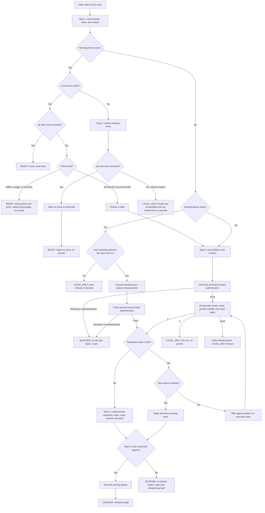
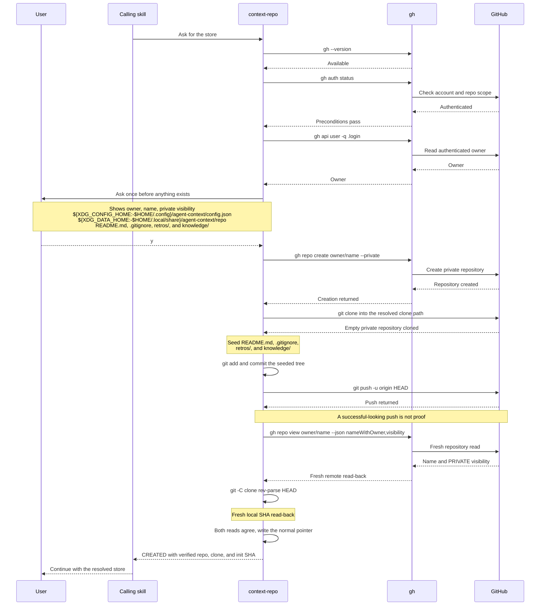
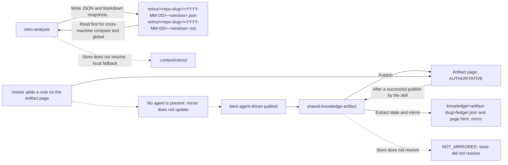

# Agent Context Store

This document describes the shared, private GitHub repository that `retro-analysis`
and `shared-knowledge-artifact` use as a durable store, and the `context-repo` skill
that resolves it. Read it when you want to understand what gets created on first use,
what happens on later runs, or how to opt out.

## What it is, and why it exists

The store is one private GitHub repository, created once per user with explicit
consent, that holds context an agent produces so it survives past the machine and
the session that generated it. `context-repo` (`plugins/olko-skill-meta/skills/context-repo/SKILL.md`)
owns finding or creating it; callers write their own content into the clone it hands
back.

The reason it exists: without it, `retro-analysis compare` and `retro-analysis
global` have no prior snapshot to compare against beyond whatever machine happened to
run the previous retro, and `shared-knowledge-artifact`'s ledger starts empty every
time an agent has no access to the Artifact page that came before it. A durable,
cross-machine store is what makes "compare this retro to the last one" or "what have
other agents already learned" answerable at all.

## How it works

The resolver follows the stored pointer before considering creation. The labels show
which branches are silent, which ask for consent, and every status it can return.



On a normal first run, the calling skill waits while `context-repo` checks the
prerequisites, asks once, creates the private store, and proves the result from fresh reads.



The two callers own separate paths in the resolved clone. Retro snapshots can fall
back locally, while the Artifact page remains authoritative over its repository mirror.



## Repository layout

```text
README.md
.gitignore
retros/<repo-slug>/<YYYY-MM-DD>-<window>.json
retros/<repo-slug>/<YYYY-MM-DD>-<window>.md
knowledge/<artifact-slug>/ledger.json
knowledge/<artifact-slug>/page.html
```

`README.md` states what the repository is, which skills write to it, that it is
private, and that it is append-only and not pruned automatically. `retros/` holds
one dated snapshot pair per repository per retrospective window; `knowledge/` holds
one ledger and one rendered page per shared-knowledge-artifact instance.

## First-run walkthrough

1. A caller (`retro-analysis` or `shared-knowledge-artifact`) needs the store and
   invokes `context-repo`.
2. `context-repo` finds no pointer at
   `${XDG_CONFIG_HOME:-$HOME/.config}/agent-context/config.json` and checks
   preconditions: `gh --version` and `gh auth status` with the `repo` scope. If
   either fails, it stops at `BLOCKED` with the remedy `gh auth login -s repo` and
   the caller falls back to local-only; nothing is created.
3. If preconditions pass, it asks once, in one message, before creating anything.
   The prompt states:
   - **Owner**: the account from `gh api user -q .login`.
   - **Name**: the proposed repository name, default `agent-context`.
   - **Visibility**: private.
   - **Paths that will be written**: the pointer file, the clone directory, and the
     seeded tree (`README.md`, `.gitignore`, `retros/`, `knowledge/`).
   - That nothing outside this one repository is touched.
4. The user answers `y`, `n`, or `never`. `y` proceeds; `n` and `never` are covered
   in the states table below.
5. On `y`, `context-repo` runs `gh repo create <owner>/<name> --private`, clones it
   to `${XDG_DATA_HOME:-$HOME/.local/share}/agent-context/repo`, seeds the tree, and
   pushes one commit: `chore: initialize agent context store`.
6. It writes the pointer, then re-reads the state from a fresh source
   (`gh repo view --json nameWithOwner,visibility` and `git rev-parse HEAD` in the
   clone) before reporting anything back. Nothing is reported as created until that
   fresh read-back agrees with what was just written.
7. It prints a receipt: `owner/name`, `visibility: PRIVATE`, clone path, and the
   init commit SHA, then hands control back to the caller.

## Subsequent-run states

| State | What the user sees |
|-------|---------------------|
| Pointer, clone, and repo all present | Silent reuse. Zero writes, zero prompts; the existing repo and clone are returned as-is. |
| Clone deleted, pointer and repo still valid | Silent re-clone into the fixed clone path; `context-repo` reports that a re-clone happened. |
| Repo deleted (or renamed, or access revoked) on GitHub | The pointer is treated as stale, not as a live answer. `context-repo` reports the stale state and re-prompts as if resolving for the first time. |
| User picks `n` | Local-only for that run. No pointer is written, so the next caller that needs the store asks again. |
| User picks `never` | A refusal-shape pointer (`{"status": "declined", ...}`) is written. Local-only forever; no future prompts. |
| `gh` gets logged out after the store was already resolved | The next run's `gh repo view` fails, the pointer is treated as stale, and the fallback precondition check finds `gh auth status` failing too, so resolution stops at `BLOCKED`. Repo, clone, and SHA report as `NOT_AVAILABLE`; the caller falls back to local-only and still completes its own run. |

## Caller contract

Once `context-repo` hands back a clone path, the caller owns everything written
into it:

- One commit per skill run, with a conventional commit message.
- `git pull --rebase` before pushing, to pick up writes made by other machines or
  agents since the last run.
- Never force push.
- Never delete or rewrite a file that already exists in the store; only add new
  files or append within a file the caller itself owns.
- If push fails, report the failure and keep the local commit. Do not retry
  silently and do not discard the commit.

## What is never committed

Raw session content, tokens, private prompts, and customer data never go into the
store. Callers may only write aggregate counts and redacted references. `context-repo`
does not inspect caller content for secrets; that responsibility stays with the
caller writing into the clone.

## The shared-knowledge-artifact mirror is not a complete log

`shared-knowledge-artifact` mirrors its Artifact page into `knowledge/<slug>/` after
a successful publish, but the Artifact page stays authoritative. Notes a viewer adds
directly on the page are not mirrored at the time they are added, because no agent
is present to commit them; the mirror only catches up the next time an agent runs
the skill and publishes again. Treat the repository copy as a recovery copy and a
diffable history, not as a complete log of everything the Artifact page has ever
held.

## Opting out and undoing

- **Decline at the prompt.** Answer `n` to stay local-only for that run, or `never`
  to stop being asked again. `never` is reversible: delete the pointer file (see
  below) to be asked fresh next time.
- **Reset the pointer.** Delete or edit
  `${XDG_CONFIG_HOME:-$HOME/.config}/agent-context/config.json`. With no pointer,
  the next caller that needs the store re-resolves it from scratch, including the
  consent prompt.
- **Delete the repository.** This is the user's action, never something a skill
  does on its own. `context-repo` never deletes, renames, or makes the repository
  public; if you delete it on GitHub yourself, the next run treats the pointer as
  stale and re-prompts, per the states table above.
