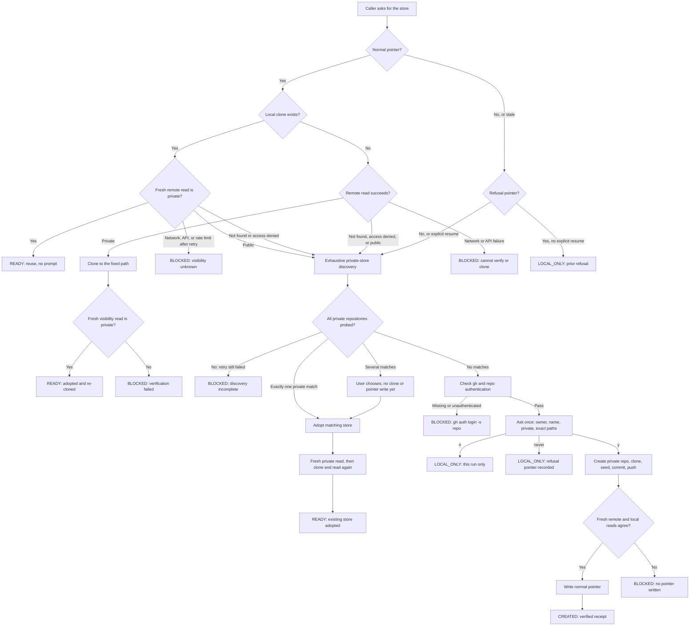
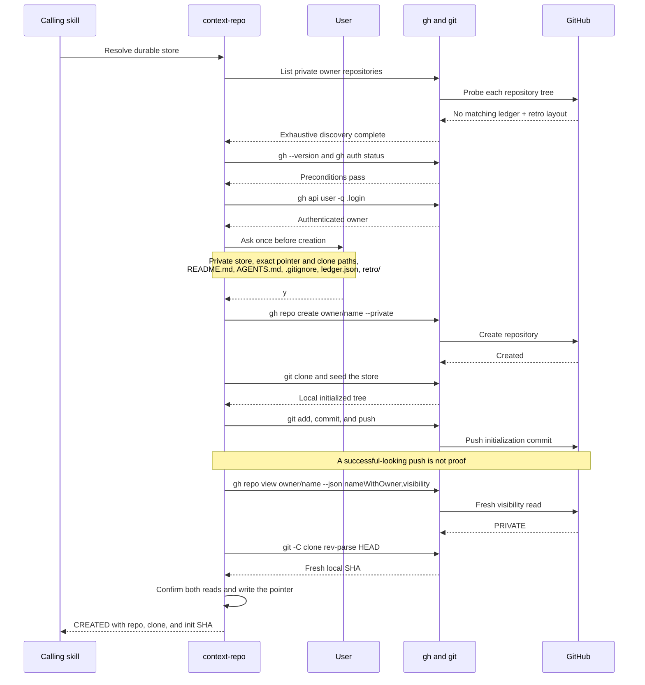

# Agent Context Store

This document describes the shared, private GitHub repository that `retro-analysis`
and `shared-knowledge-artifact` use as a durable store, and the `context-repo` skill
that resolves it. Read it when you want to understand what gets created on first use,
what happens on later runs, or how to opt out.

## What it is, and why it exists

The store is one private GitHub repository that holds context an agent produces so it
survives past the machine and the session that generated it. `context-repo`
(`plugins/olko-skill-meta/skills/context-repo/SKILL.md`) owns resolving it; callers
write their own content into the clone it hands back.

Resolving means finding the store first and creating one only as a last resort. Anyone
who has been running agents for a while probably already has a store, under a name this
skill would never guess, and a second store is worse than no store: it splits the record
and neither half is complete. So `context-repo` searches the account by layout before it
offers to create anything, and adopts what it finds.

The reason it exists: without it, `retro-analysis compare` and `retro-analysis
global` have no prior snapshot to compare against beyond whatever machine happened to
run the previous retro, and `shared-knowledge-artifact`'s ledger starts empty every
time an agent has no access to the Artifact page that came before it. A durable,
cross-machine store is what makes "compare this retro to the last one" or "what have
other agents already learned" answerable at all.

## How it works

The resolver searches for an existing private store before offering creation. The
diagram includes the silent reuse paths, the explicit consent boundary, and every
terminal status the caller can receive.



On a normal first run, the caller waits while `context-repo` completes discovery,
checks prerequisites, asks once, creates the private store, and verifies it from
fresh reads before returning a receipt.



The callers then own distinct content in the same clone: `retro-analysis` writes
one uniquely named Markdown snapshot under `retro/`, while
`shared-knowledge-artifact` appends notes to the root `ledger.json` and treats its
Artifact page as the user-facing view. Both follow the store's lease, pull-before-
push, validation, append-only, and no-force-push rules.

## Repository layout

```text
README.md
AGENTS.md
.gitignore
ledger.json
retro/<run-id>-<scope-key>-<window>.md       # preferred
retros/<run-id>-<scope-key>-<window>.md      # legacy stores
```

`ledger.json` at the repository root is the single shared ledger, one file for every
agent and every project rather than one per artifact:

```json
{"name": "...", "version": 1, "notes": [
  {"id": "n1", "kind": "lesson|trap|pref", "scope": "...", "title": "...",
   "body": "...", "why": "...", "author": "...", "date": "YYYY-MM-DD"}
]}
```

Ids are `n<number>` or `c<number>` and are never reused. The ledger is append-only and
that rule is mechanical, not advisory: a store with CI runs a validator that fails the
build when a note disappears.

`retro/` is flat and markdown only, one uniquely named file per retrospective whose
scope key identifies the analyzed repository or global scope and whose name includes a
per-run id and window. `retros/` is the legacy spelling; a repository containing either
directory is the same store and must be reused rather than duplicated. `README.md`
states what the repository is, which skills write to it, that it is private, and that
it is append-only and not pruned automatically. `AGENTS.md` provides operational
defaults every agent reads before substantive work, but it cannot weaken the mandatory
lease, validation, append-only, secret-handling, or private-repository requirements.

The probe requires a root `ledger.json` plus either `retro/` or legacy `retros/`. A
private repository with that layout is the same store, whatever it is called.

## First-run walkthrough

1. A caller (`retro-analysis` or `shared-knowledge-artifact`) needs the store and
   invokes `context-repo`.
2. `context-repo` finds no normal pointer at
   `${XDG_CONFIG_HOME:-$HOME/.config}/agent-context/config.json` and exhaustively
   paginates the account's private repositories. It probes every tree for a root
   `ledger.json` and either `retro/` or legacy `retros/`. Transient listing or probe
   failures are retried once; if discovery remains incomplete, it stops at `BLOCKED`
   without offering creation.
3. One private match is adopted silently after a fresh visibility read. Several matches
   are listed with their `pushedAt` dates, ordered only for display, and the user must
   choose before any clone, pointer write, or `READY` result. Only when exhaustive
   discovery finds nothing does the skill check creation preconditions (`gh --version`
   and `gh auth status` with the `repo` scope) and go on to offer creation.
4. It asks once, in one message, before creating anything. The prompt states:
   - **Owner**: the account from `gh api user -q .login`.
   - **Name**: the proposed repository name, default `shared-agent-knowledge`.
   - **Visibility**: private.
   - **Paths that will be written**: the pointer file, the clone directory, and the
     seeded tree (`README.md`, `AGENTS.md`, `.gitignore`, `ledger.json`, `retro/`).
   - That the search in step 3 found nothing, and which repositories it checked, so
     the user can correct it if they know of a store it missed.
   - That nothing outside this one repository is touched.
5. The user answers `y`, `n`, or `never`. `y` proceeds; `n` and `never` are covered
   in the states table below.
6. On `y`, `context-repo` runs `gh repo create <owner>/<name> --private`, clones it
   to `${XDG_DATA_HOME:-$HOME/.local/share}/agent-context/repo`, seeds the tree, and
   pushes one commit: `chore: initialize agent context store`.
7. It writes the pointer, then re-reads the state from a fresh source
   (`gh repo view --json nameWithOwner,visibility` and `git rev-parse HEAD` in the
   clone) before reporting anything back. Nothing is reported as created until that
   fresh read-back agrees with what was just written.
8. It prints a receipt: `owner/name`, `visibility: PRIVATE`, clone path, and the
   init commit SHA, then hands control back to the caller.

## Subsequent-run states

| State | What the user sees |
|-------|---------------------|
| Pointer, clone, and private repo all present | Silent reuse after a fresh `visibility == PRIVATE` read. Zero writes and zero prompts. |
| Clone deleted, pointer and private repo still valid | Silent re-clone into the fixed clone path, followed by another private-visibility read; `context-repo` reports that a re-clone happened. |
| Pointer targets a public repo | The pointer is rejected. A public repository is never returned as `READY` or used for context writes. |
| Repo renamed on GitHub | The pointer is treated as stale, not as a live answer, and the layout search finds the store under its new name and re-points to it. No prompt, nothing created. |
| Repo deleted or access revoked on GitHub | The pointer is stale and the search finds no replacement, so `context-repo` re-prompts as if resolving for the first time. |
| User picks `n` | Local-only for that run. No pointer is written, so the next caller that needs the store asks again. |
| User picks `never` | A refusal-shape pointer (`{"status": "declined", ...}`) is written. Local-only forever; no future prompts. |
| Provider visibility cannot be verified | The read is retried once, then resolution stops at `BLOCKED` without changing the pointer or creating a replacement. The caller falls back to local-only and still completes its own run. |

## Caller contract

Once `context-repo` hands back a clone path, the caller owns everything written
into it:

- **Take the store's lease before writing**, when it ships one. Several agents share a
  single GitHub identity, so the commit log cannot tell them apart and the failure mode
  is not a bad edit but two correct edits that contradict each other. In the current
  store the tool is `recipes/tools/task-claim`; exit code 3 means another agent holds
  the lease, which means wait or pick different work.
- One commit per skill run, with a conventional commit message.
- `git pull --rebase` before pushing, to pick up writes made by other machines or
  agents since the last run.
- **Run the store's own validator before pushing**, when it has one. In the current
  store that is `node recipes/tools/validate-ledger.js --baseline origin/main`, and its
  CI runs the same check on push and pull request.
- Never force push.
- Never delete or rewrite a file that already exists in the store; only add new
  files or append within a file the caller itself owns. For `ledger.json` that means
  appending to `notes` with a fresh id and touching nothing already there.
- If push fails, report the failure and keep the local commit. Do not retry
  silently and do not discard the commit.
- Read `AGENTS.md` before substantive work and apply its operational defaults only
  where they do not conflict with this contract. It cannot override lease acquisition,
  validation, append-only writes, secret handling, or the private-repository requirement.

## What is never committed

Raw session content, tokens, private prompts, and customer data never go into the
store. Callers may only write aggregate counts and redacted references. `context-repo`
does not inspect caller content for secrets; that responsibility stays with the
caller writing into the clone.

## Viewer notes reach the ledger late

The store's `ledger.json` is the canonical record and an Artifact page is a view onto
it, so `shared-knowledge-artifact` writes new notes through to the ledger after a
successful publish. Notes a viewer adds directly on the page are the exception: no
agent is present when that happens, so they are not written through at the time. They
reach the ledger only on the next agent-driven publish, and until then they are not
shared guidance. Say so on the page rather than letting a viewer assume their note is
already canonical.

## Opting out and undoing

- **Decline at the prompt.** Answer `n` to stay local-only for that run, or `never`
  to stop being asked again. `never` is reversible: delete the pointer file (see
  below) to be asked fresh next time.
- **Reset the pointer.** Delete or edit
  `${XDG_CONFIG_HOME:-$HOME/.config}/agent-context/config.json`. With no pointer,
  the next caller that needs the store re-resolves it from scratch, including the
  consent prompt.
- **Delete the repository.** This is the user's action, never something a skill
  does on its own. `context-repo` never deletes, renames, or makes the repository
  public; if you delete it on GitHub yourself, the next run treats the pointer as
  stale and re-prompts, per the states table above.
