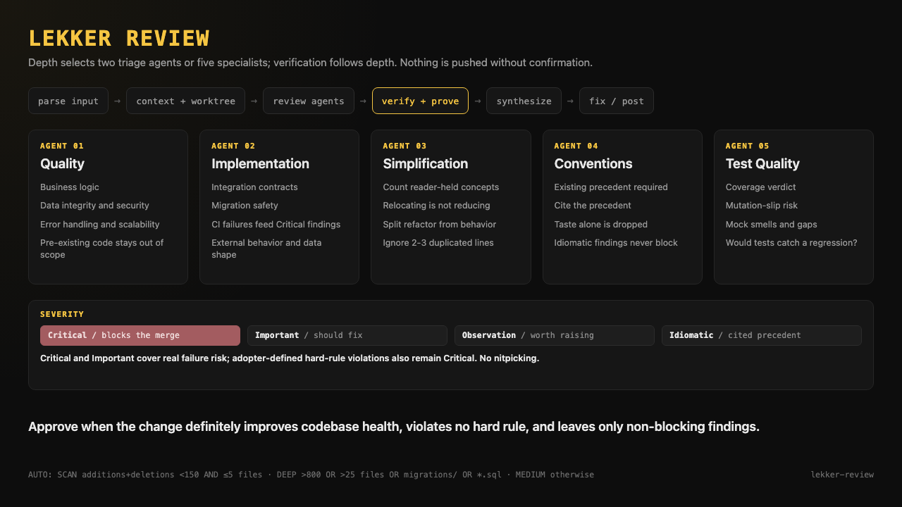
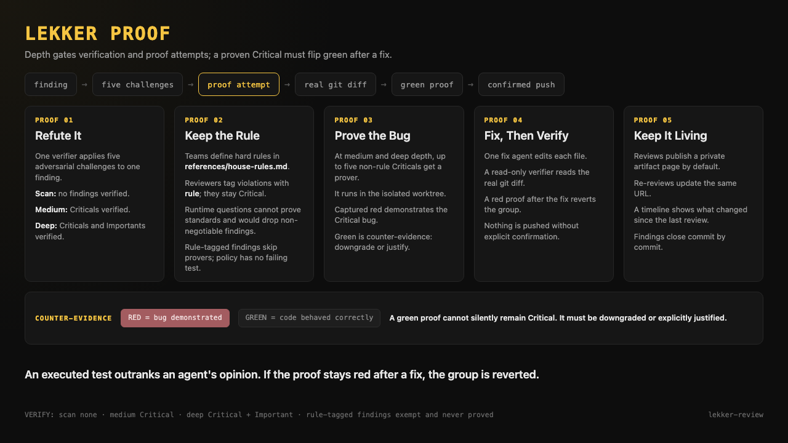

# lekker-review

FAANG-quality PR code review for GitHub. It gathers the context a human reviewer
would gather and checks the branch out into an isolated worktree when the depth
requires one. `scan` runs two triage agents without a verifier. `medium` and
`deep` run five specialists and attempt proofs for at most five non-rule
Critical findings.



## Why it is not a checklist reviewer

Most review tooling reports whatever the model believed on its first pass.
This skill spends most of its budget trying to disprove itself.



- **Adversarial verification.** `medium` sends non-rule Criticals through an
  independent verifier's five-challenge refutation; `deep` also sends
  Importants. `scan` does not run verifiers.
- **Proof of bug.** In `medium` and `deep`, up to five non-rule Criticals are
  sent to prover agents that attempt to write and run a failing test. A proof
  that comes back green is counter-evidence: the finding is downgraded or
  explicitly justified, never quietly kept.
- **Hard-rule exemption.** A finding tagged with a `rule` keeps Critical
  severity and skips verification, because the verifier asks runtime-failure
  questions that a standards violation can never answer.
- **Fix mode.** `--fix` has one agent edit each file, a read-only verifier read
  the real `git diff`, and the captured proof re-run. If the proof stays red the
  group is reverted. Nothing is pushed without explicit confirmation.

## Requirements

Claude Code only. The review pipeline needs the Workflow tool for multi-agent
orchestration and the Artifact tool for the living review page. `git` and an
authenticated `gh` are required.

## Setup

`references/house-rules.md` ships as a template. Replace its example rules with
your team's own non-negotiables, the ones that should always be Critical
regardless of review depth. The skill has no hard rules of its own: everything
blocking comes from that file.

## Usage

```text
lekker-review https://github.com/owner/repo/pull/123
lekker-review owner/repo 123 deep --post
lekker-review owner/repo 123 --fix
```

Depth is auto-selected from the diff size when you do not name one: `scan` under
150 changed lines and 5 files, `deep` over 800 changed lines or 25 files or when
the diff touches migrations or `*.sql`, `medium` otherwise.

## Regenerating the posters

The posters are self-contained HTML in `assets/`. Open either file in a browser
at a 1280x720 viewport and screenshot it to regenerate the PNG.
